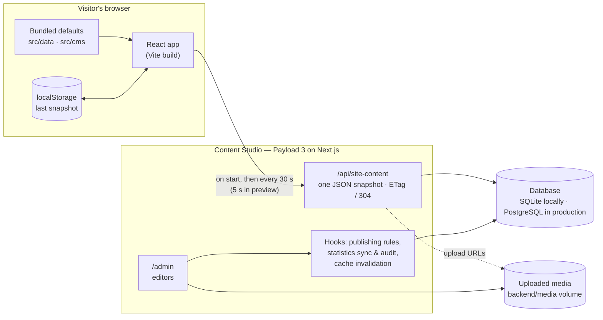
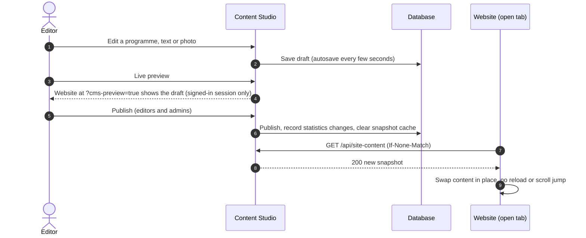
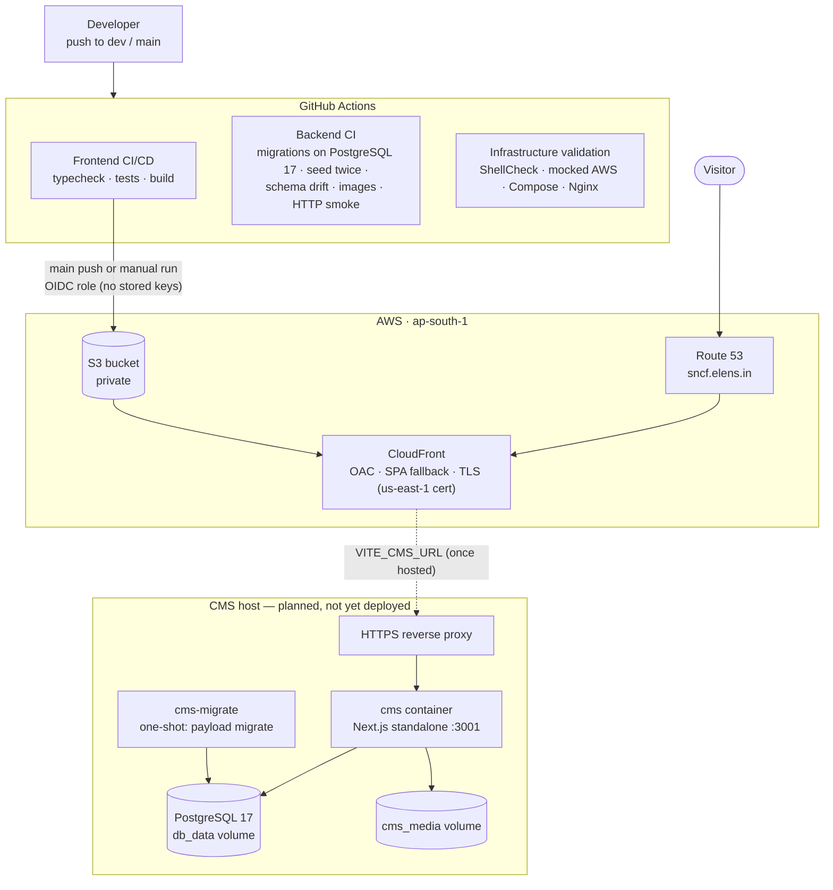
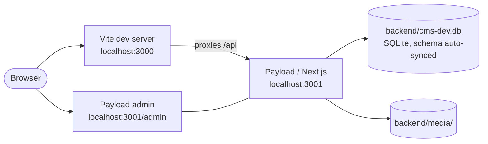

# Sant Nirankari Charitable Foundation — website

The SNCF website combines a responsive React frontend, interactive 3D pillar models, and a Payload CMS (the **Content Studio**) for content, media, statistics and site settings.

| | Address |
| --- | --- |
| Live website | https://sncf.elens.in (static build on S3 + CloudFront) |
| Content Studio | Not yet hosted in production — runs locally at `http://localhost:3001/admin` |
| Repository | `elens-ai/sncf-website` — work happens on `dev`; `main` deploys automatically |

Until the CMS is hosted and `VITE_CMS_URL` is set, the live website shows the content bundled into its build. Everything below still works locally end to end.

## Contents

- [Features](#features)
- [Architecture](#architecture)
- [Infrastructure](#infrastructure)
- [Tech stack](#tech-stack)
- [Run locally](#run-locally)
- [Commands](#commands)
- [Configuration](#configuration)
- [Validate changes](#validate-changes)
- [Deployment](#deployment)
- [Repository layout](#repository-layout)
- [Troubleshooting](#troubleshooting)

## Features

- A home page that rotates through Heal, Enrich, Empower and Projects, then opens “Our work”: each pillar's photo emblem among its programmes, with hover photo collages and a soft light wave.
- Pages for core values, projects, the foundation and its guiding force, alongside events, partners and awards.
- Phone, tablet and landscape layouts, with accessible navigation and mobile search.
- CMS control of every text slot, photos and galleries, programme figures and presentation, menu, footer, social links, 3D models, statistics and section visibility/order — see [CMS.md](CMS.md).
- Drafts, live preview, editor publishing and an audit trail for statistics. Published changes reach open tabs within about 30 seconds; cached and bundled content keep the site usable when the CMS is unavailable.

| Route | Page |
| --- | --- |
| `/` | Home: hero, Our work, events, awards, partners |
| `/core-values` | Heal, Enrich and Empower in depth, with programme figures and charts |
| `/projects` | Flagship projects, their figures and galleries |
| `/who-we-are` | The foundation, mission, timeline, partners and contact |
| `/our-guiding-force` | The guidance behind the foundation's work |
| `/contribute`, `/donate` | Contribution form (collects details; payments are not yet connected) |
| `/pages/:slug` | Extra pages built from CMS sections |

## Architecture

### How the website gets its content

The website never waits on the CMS. It renders immediately from content bundled into the build (or the last copy it cached), then swaps in the published snapshot when it arrives.



- **One request, one snapshot.** `GET /api/site-content` returns pillars, programmes, events, partners, awards, galleries, pages, text slots, image slots, section switches, site settings, 3D models and statistics. Unchanged content answers `304`.
- **Fail-safe.** The first fetch has a 1.2-second deadline. A malformed or missing item falls back to its bundled equivalent on its own, so one bad entry never blanks a section.
- **Editable slots.** Components read text with `getCMSCopy(key, fallback)` and design images with `resolveCMSAsset` / `resolveCMSMedia`; the fallback is what ships in the build. The slot registries in `src/cms/` are kept in step with the code by `npm run cms:registry` and a test.

### How an edit reaches the site



Roles: **contributors** draft, **editors** publish and manage media, **admins** also manage people and site setup.

## Infrastructure

### Production



- **Website hosting** (`infra/bootstrap.sh`, run by an operator): a private S3 bucket behind CloudFront with Origin Access Control, Route 53 alias records for `sncf.elens.in`, and an IAM role that GitHub Actions assumes through OIDC, scoped to the `production` environment.
- **Caching**: hashed `/assets/` files are immutable for a year; `index.html` never caches; photos, models and videos revalidate so replaced files show up. Each deployment invalidates CloudFront.
- **CMS hosting** (`docker-compose.yml`, profile `cms`): `db` (PostgreSQL 17) → `cms-migrate` (applies migrations, then exits) → `cms` (starts only after a successful migration). Uploads live on a named volume so rebuilding never loses media. Ports bind to loopback; put HTTPS in front with a reverse proxy.

### Local development



Docker alternatives: `docker compose --profile dev up` (website with live reload plus a local PostgreSQL), `--profile prod` (the Nginx production image on port 8080), `--profile cms` (the production CMS stack).

## Tech stack

| Layer | Technology |
| --- | --- |
| Website | React 19, React Router 7, Vite 6, Tailwind CSS 4, Motion, Three.js (3D models), Lucide icons |
| CMS | Payload 3 on Next.js 16, Lexical editor, Sharp image sizes |
| Database | SQLite locally; PostgreSQL 17 in production and CI (versioned migrations) |
| Hosting | S3 + CloudFront + Route 53 (website); Docker Compose + Nginx (containers) |
| CI/CD | GitHub Actions with AWS OIDC |
| Runtime | Node.js 22 (24 also works locally) |

## Run locally

Requirements: **Node.js 22** and npm (and Git). No Docker, database server or API key is needed.

**Website only** (uses bundled content):

```sh
npm ci
npm run dev
```

Open `http://localhost:3000`.

**Website + Content Studio:**

1. In `backend`, run `npm ci`.
2. Copy `backend/.env.example` to `backend/.env` if it does not already exist, and set `PAYLOAD_SECRET` to a private value from `openssl rand -base64 32`.
3. From the repository root, run `npm run cms:seed` to generate the import file.
4. In `backend`, run `npm run seed`, then `npm run dev`.
5. In the repository root, run `npm run dev`.
6. Open `http://localhost:3001/admin` and create the first administrator account (the first account is always an admin).

The Vite server proxies `/api` to the local CMS, so the website at `http://localhost:3000` shows CMS content and drafts in preview. Use the same hostname for both (`localhost` or `127.0.0.1`) so preview cookies work. See [CMS.md](CMS.md) for editing, images, previews and publishing.

## Commands

| Where | Command | What it does |
| --- | --- | --- |
| root | `npm run dev` | Website dev server on port 3000 |
| root | `npm run build` | Production build into `dist/` |
| root | `npm run lint` / `npm test` | Typecheck / unit tests (including the CMS slot registry) |
| root | `npm run cms:registry` | Report CMS text/image slots out of step with the code; `-- --write` fixes them |
| root | `npm run cms:seed` | Regenerate `backend/seed/site-content.json` from the bundled content |
| backend | `npm run dev` | Content Studio on port 3001 |
| backend | `npm run seed` | Import missing content (never overwrites edits) |
| backend | `npm run migrate` / `npm run migrate:create <name>` | Apply / create PostgreSQL migrations |
| backend | `npm run generate:types` / `npm run generate:importmap` | Refresh Payload types / admin component map after config changes |
| backend | `npm run export:content` | Write the published snapshot to `public/cms-content.json` |

## Configuration

**Website** (build time, public):

| Variable | Purpose |
| --- | --- |
| `VITE_CMS_URL` | Public HTTPS origin of the CMS, e.g. `https://cms.example.org`. Unset: the site uses `/api` on its own origin, else bundled content. Never put secrets in `VITE_` variables. |
| `CMS_PROXY_TARGET` | Dev only: where Vite proxies `/api` (default `http://127.0.0.1:3001`). |

**CMS** (`backend/.env`, private, never committed):

| Variable | Purpose |
| --- | --- |
| `PAYLOAD_SECRET` | Random secret, at least 32 characters in production |
| `DATABASE_URI` | `file:./cms-dev.db` locally; a PostgreSQL URL in production |
| `PAYLOAD_PUBLIC_SERVER_URL` | Public URL of the CMS |
| `PAYLOAD_PUBLIC_SITE_URL` | Public URL of the website (used by live preview) |
| `CMS_ALLOWED_ORIGINS` | Extra origins allowed to call the CMS (comma-separated) |

**GitHub repository variables** (deployment): `AWS_ROLE_ARN`, `AWS_REGION`, `S3_BUCKET`, `CLOUDFRONT_DISTRIBUTION_ID`, and optionally `VITE_CMS_URL`. See [DEPLOYMENT.md](DEPLOYMENT.md).

## Validate changes

From the repository root:

```sh
npm run lint
npm test
npm run build
node --test infra/*.test.cjs scripts/check-cms-url.test.cjs   # needs a Linux shell and jq
```

In `backend`:

```sh
npm run lint
npm test
node --import tsx scripts/access-integration.ts
npm run build
node --import tsx scripts/smoke-api.ts                         # with a seeded CMS running
```

The checks cover CMS validation and fallback, the slot registry, programme presentation fields, live statistics, permissions, preview links, the public snapshot, animation scheduling, gallery assets and infrastructure configuration. Browser checks should also cover phone, tablet, landscape and desktop layouts.

## Deployment

| Workflow | Runs on | Purpose |
| --- | --- | --- |
| [Frontend CI/CD](.github/workflows/frontend.yml) | push/PR to `main`, `dev`, `vansh` | Lockfile install, typecheck, tests and build. Deploys to S3/CloudFront on `main` pushes or a manual run. |
| [Backend CI](.github/workflows/backend.yml) | backend changes | Access tests, fresh PostgreSQL migrations, seed idempotence, schema drift, container builds and HTTP checks. Does not deploy. |
| [Infrastructure validation](.github/workflows/infra.yml) | infra changes | Shell/Bootstrap checks, mocked AWS requests, Compose profiles, frontend image and Nginx configuration. |

Deploy the website from `dev` without merging (publishes to production):

```sh
gh workflow run frontend.yml --ref dev -f deploy=true
```

The CMS is a separate persistent service: deploying the static website does not deploy its database or admin. Before a CMS release, back up the database and media together, then run migrations (the `cms-migrate` container does this). See [DEPLOYMENT.md](DEPLOYMENT.md) for GitHub variables, CMS hosting, OIDC, caching and provisioning, and [backend/README.md](backend/README.md) for roles, API access, migrations and backups.

## Repository layout

```text
.
├── src/                    Website (React)
│   ├── pages/              Routed pages
│   ├── components/         Sections, modals and UI
│   ├── data/               Bundled content: pillars, programmes, events, partners, awards, galleries, menu
│   ├── cms/                Snapshot runtime, validation, site/3D settings, text & image slot registries
│   └── utils/              Animation, layout and helper utilities
├── public/                 Bundled images, programme photos, 3D models, videos
├── scripts/                Seed generation, slot registry check, CMS URL validation
├── backend/                Content Studio (Payload + Next.js)
│   ├── src/collections/    Content, media, statistics and users
│   ├── src/globals/        Site settings and 3D models
│   ├── src/cms/            Snapshot endpoint, field helpers, preview links, caching, statistics sync
│   ├── src/components/     Admin dashboard, image preview, colour picker, list thumbnails
│   ├── src/migrations/     PostgreSQL migrations (CI rejects schema drift)
│   ├── scripts/            Seed, export, tests and API smoke checks
│   └── seed/               Generated content import
├── infra/                  AWS bootstrap (S3, CloudFront, Route 53, OIDC role)
├── docker/                 Nginx configuration for the production image
├── Dockerfile              Website images (dev, prod)
├── docker-compose.yml      Website, database and CMS containers
├── CMS.md                  Editor and developer guide for the Content Studio
└── DEPLOYMENT.md           CI/CD, hosting and provisioning details
```

Keep local secrets, database files, generated builds and uploaded media out of Git.

## Troubleshooting

| Problem | Fix |
| --- | --- |
| `npm` / `git` not recognised in a terminal opened before installing Node or Git | Open a new terminal, or reload PATH in PowerShell: `$env:Path = [Environment]::GetEnvironmentVariable('Path','Machine') + ';' + [Environment]::GetEnvironmentVariable('Path','User')` |
| Port 3000 or 3001 already in use | A dev server is already running — use it, or stop that Node process first. |
| Website shows bundled content, not CMS edits | Check the CMS is running on 3001 and the edit is **published**; tabs refresh within about 30 s. |
| Blank page right after adding a dependency | Vite re-optimised its dependency cache mid-load; refresh once. |
| Website dev server stops with `ECONNRESET` | Restart `npm run dev`; the content is unaffected. |
| CMS asks to accept data-loss warnings on start | The schema changed. Back up `backend/cms-dev.db`, then re-seed a fresh database, or accept in an interactive terminal. |
| Signed out of the Content Studio after a database rebuild | Sign in again; sessions are stored in the database. |
